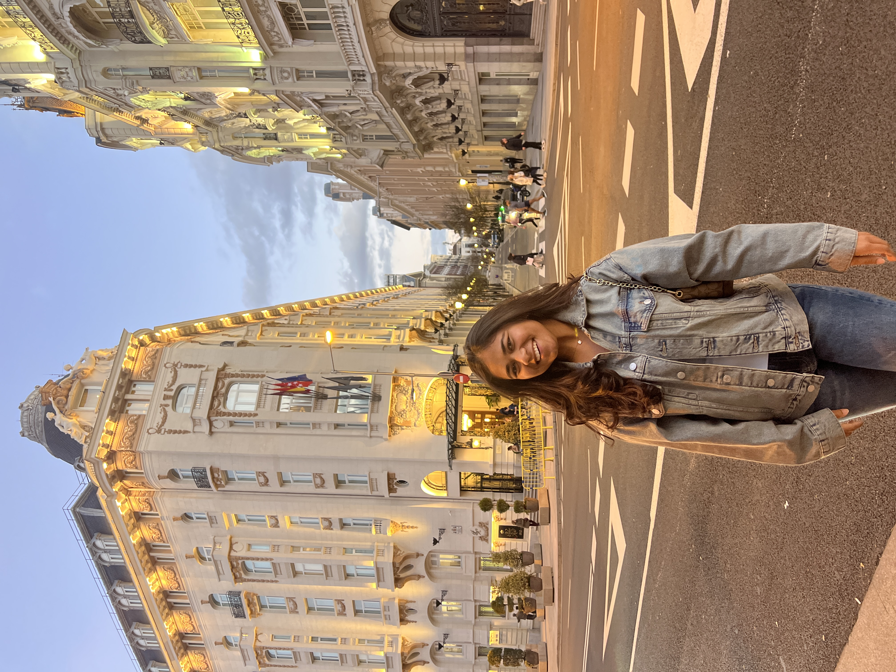

# Mehak's User Page


## Profile
Hi! My name is **Mehak**. I am a senior at UCSD, majoring in Mathematics- Computer Science.

## Skills and Interests
I am skilled in languages like *Python*, *Java*, *C++*, *C programming*. I am intersted in **fintech**, **software engineering** and **human-computer interaction**.
I love to travel and explore more places asides programming. I visited Spain with my friends this spring break.

## Life Mantra
I belived in the quote by Lucius Annaeus Seneca
> Travel and change of place impart new vigor to the mind.

## Places I have travelled
1. Spain
2. London
3. Singapore
4. Paris
5. Hongkong
6. Turkey

## Example of Python code
Code snippet
```
python
def greet(name):
    return f"Hello, {name}! Welcome to my page."

print(greet("Mehak"))
```
To know what is my favorite programming language [click here](README.md) </br>
I do know other languages too! </br>
[Other programming skills](#skills-and-interests)

I have taken courses like:
- CSE100
+ CSE105
* CSE101
   
## Want to know more about me?
Linkedin link: [linkedin](https://www.linkedin.com/in/mehak-gupta-bb0377284/) 


